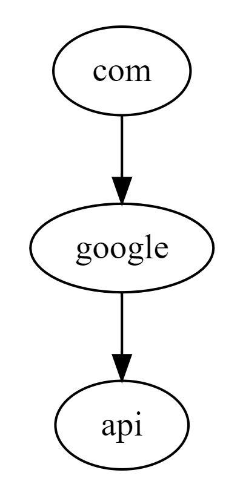

# 域名后缀树（Golang）

## 一、什么是域名后缀树

类似于字典后缀树，不同的是域名后缀树是以.切分域名的各个部分， 对域名中的每个部分作为一个Node建立后缀树以便高效进行后缀匹配查询。

比如：

```text
www.google.com
```

会以.分割域名为三个部分，每个部分建立一个节点：



再增加一个：

```text
baidu.com
```

此时后缀树是这样子的：


## 二、业务场景举例

比如现在有n个域名后缀，称之为集合A：

```text
google.com
api.baidu.com
007.qq.com
```

然后有m个域名，称之为集合B：

```text
a.google.com
b.google.com
c.google.com
google.com
google3.com
a.api.baidu.com
b.api.baidu.com
003.qq.com
a.007.qq.com
```

现在要为这集合B中的每个域名从集合A中做后缀匹配，这个工具类就是用来解决这个问题的。

## 三、Example

添加此项目作为依赖：

```text
go get -u github.com/CC11001100/go-domain-suffix-tree
```

代码示例（DomainSuffixTree是线程安全的）：

```go
package main

import (
	"fmt"
	"github.com/CC11001100/go-domain-suffix-tree/pkg/domain_suffix_trie"
)

func main() {

	// 调用 #NewDomainSuffixTrie 创建一颗后缀树
	tree := domain_suffix_trie.NewDomainSuffixTrie()

	// 将需要匹配的域名后缀依次调用 #AddDomainSuffix 添加到树上，添加的时候可以为后缀指定一个payload（使用集合A构建树）
	_ = tree.AddDomainSuffix("google.com", "谷歌主站子域名")
	_ = tree.AddDomainSuffix("map.google.com", "谷歌地图子域名")
	_ = tree.AddDomainSuffix("baidu.com", "百度主站子域名")
	_ = tree.AddDomainSuffix("jd.com", "京东子域名")

	// 需要查询的时候调用 #FindMatchDomainSuffixPayload 或者 #FindMatchDomainSuffixNode 查询，
	// 参数是一个完整的域名，会返回此域名匹配到的后缀在之前指定的payload（将集合B的每个元素依次在树上查询）
	fmt.Println(tree.FindMatchDomainSuffixPayload("test.google.com"))           // output: 谷歌主站子域名
	fmt.Println(tree.FindMatchDomainSuffixPayload("test.map.google.com"))       // output: 谷歌地图子域名
	fmt.Println(tree.FindMatchDomainSuffixNode("test.baidu.com").GetNodePath()) // output: baidu.com
	fmt.Println(tree.FindMatchDomainSuffixNode("test.jd.com").GetNodeValue())   // output: jd

}
```
